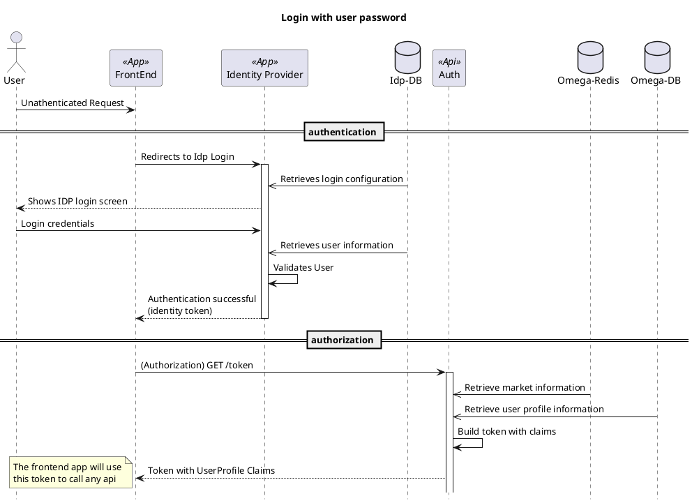
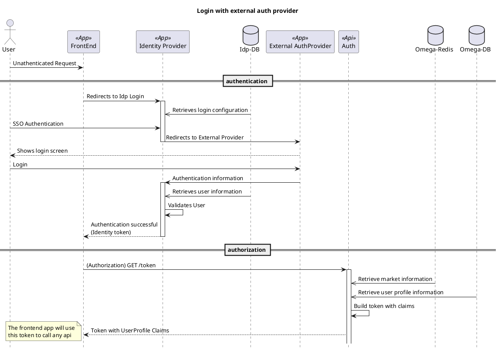

## Short summary

When the user tries to access the **Frontend application**, if he is not logged in or the login has expired, the application will redirect to the login page of the **Identity Provided**.

Based on the parameters of the redirection, the **Identity Provider** will retrieve from its database the parameters needed to perform that authentication.

The next step depend on whether the user chooses to use a login / password authentication or an external authentication provider:

1. If the user chooses to use an user password authentication:\
The user submits his login credentials to the **Identity Provider**, and it will validate the user and redirect him to the configured return_url as authenticated (if the login is successful)

2. If the user chooses to use an **External auth provider (SSO)** the **Identity provider** redirects the user to the external auth provider.\
Once the user logins on the external provider, the external provider will redirect the user back to the **Identity Provider**  with the Authentication information.

The Identity Provider will validate the user information, and redirect the user back to the Frontend application if the authentication is successfull

The **Frontend application** will request an access token to the **Auth Api**. This api will retrieve the user profile information, the market and marketClientId,  perform some validation and fill the user claims, and send am JWT token back to the **FrontEnd application**.

The Frontend application will use that Authorization token to call in any further call to the Omega apis.

## Diagrams

### Standard Login

### Login with external Auth Provider

