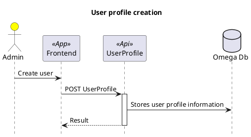
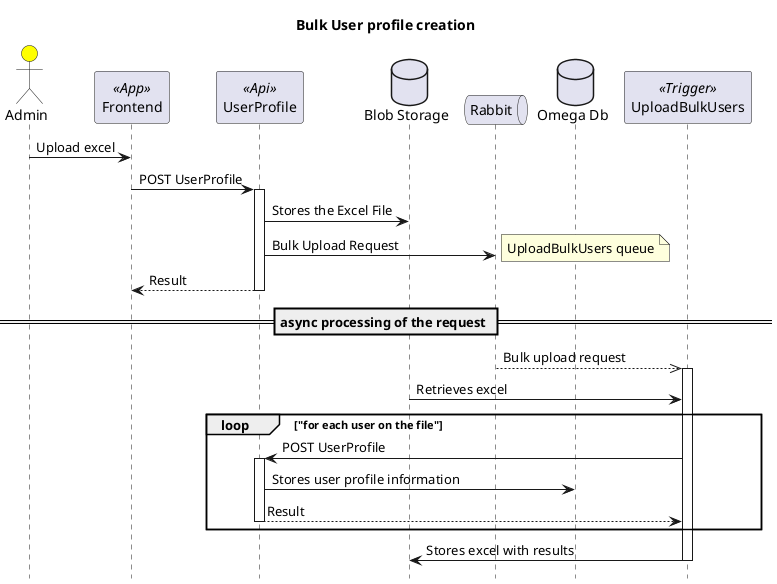

## Short summary

The administrator can create users via the front-end application without the need for preexisting user registration.

Users can be created individually or in bulk (by uploading an Excel with the user information) via the front-end application

When users are created via a bulk upload, they will be created in the Omega database with a status that indicates that
they were created via a bulk upload.
In this case instead of waiting for all the users to be created, the request is stored in the UploadBulkUsers.Queue to be processed asyncronously

In both cases (individual and bulk creation) the required user configuration will be checked and completed by the administrator, and the user's status will be changed to "pending confirmation".

To enable the access to the application, the administrator will use the "confirm user" action, and the [User Confirmation Flow](./User-profile-confirmation.md) will start

## Diagram

### Individual User Creation

### Bulk user creation

> Note: 
The following diagram ilustrates the flow of a single upload of file.

