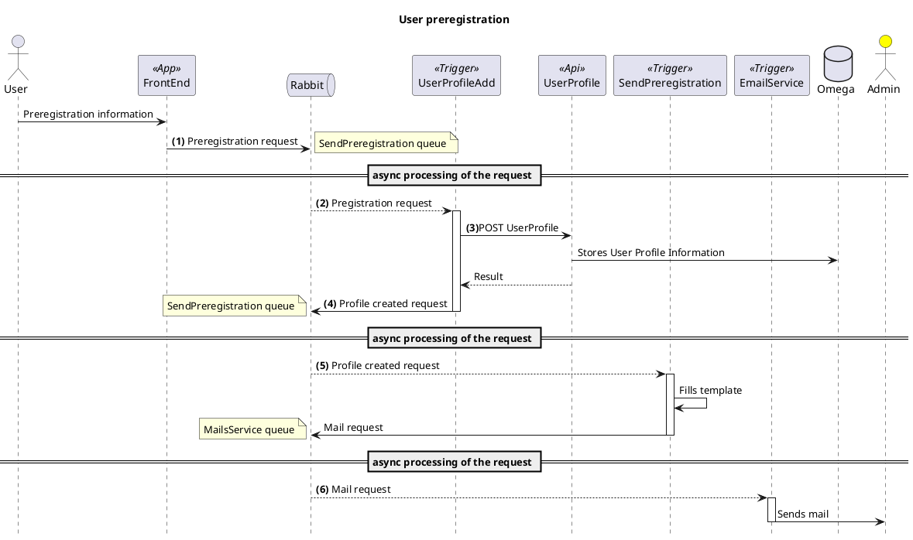

## Short summary

> Note: 

> This scenario hasn't been fully defined / implemented. 
All the text in _Italic_ is pending of definition and or implementation

When the user is not registered and tries to connect, there is a link on the IDP login page that will redirect him
to the front-end preregistration page. Here, they will need to provide the required preregistration information (to be defined)
Once the user submits the request, the user profile will be created _and a mail notification sent to the administrator_

The administrator will use the frontend user management page to add further information to the user details, granting the access to the corresponding items and once he clicks the **Confirm User action**, the [User Confirmation Flow](./User-profile-confirmation.md) will start.

## Diagram

> Legend: 

> 1. _The **Frontend** sends the information and stores it into the **UserCreated.Queue**_ 
> 2. The **Idp.UserProfileAddTrigger** retrieves the information from the queue 
> 3. The **Idp.UserProfileAddTrigger** post the information to the **Frontoffice.UserProfileApi** to create a new user profile
> 4. _If the creation is successful, the **Idp.UserProfileAddTrigger** sends the user information to the **SendPreregistration.Queue**_ 
> 5. _The **MailingService.SendPreregistrationTrigger** retrieves the user information from the **SendPreregistration.Queue**, retrieves the orresponding mail template, fills it out, and sends a 
notification to the **MailService.Queue**_ 
> 6. _The **MailService.EmailServiceTrigger** sends the mail to the administrators_
