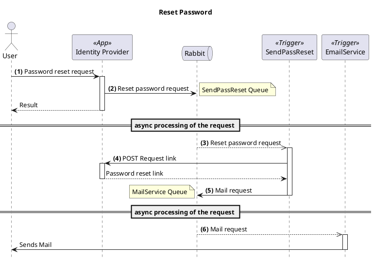

## Short summary

When the user starts a password reset flow, the reset password request will be stored in the SendPassReset Queue.

The MailingService.SendPassResetTrigger will process each one of the queued request. For each one, it:

- Performs a POST to the IDP requesting a new link to send to the user.
- Retrieves and fills out the corresponding mail template, and sends it to the MailService Queue

The MailService.EmailServiceTrigger will process each one of the queued request. For each one, it will send the mail to the proper recipients.

The following diagram ilustrates the flow of a single request by the a user.

## Diagram

> Legend:

> 1. The **User** clicks on the reset password option
> 2. The **Idp** send a Reset password notification to the **SendPassReset.Queue**
> 3. The **Idp.SendPassResetTrigger** retrieves the request
> 4. The **Idp.SendPassResetTrigger** POST the IDP to retrievea reset link
> 5. The **Idp.SendPassResetTrigger** fills out the mail template, and sends a notification to the **MailService.Queue**
> 6. The **MailService.EmailServiceTrigger** send the mail to the user.

