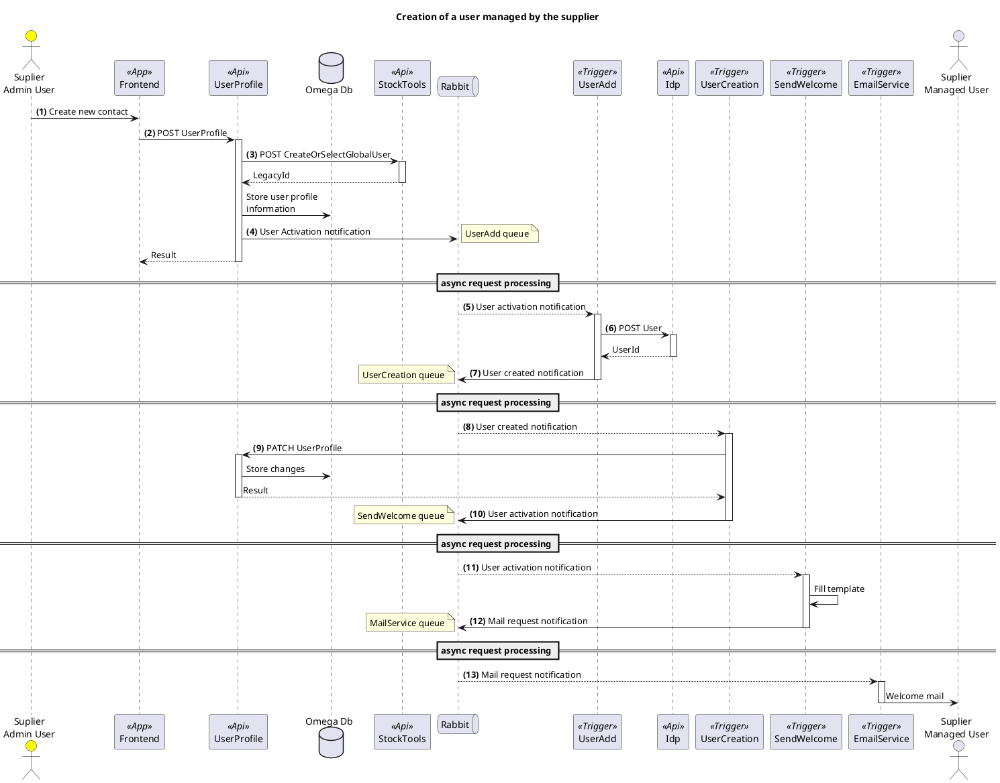

## Summary

An admin user from the supplier fills the new contact information and selects the role **"Supplier Admin"** or **"Supplier User"**.

 When clicks the _Create_ button a multi-step asyncrononous process will begin:

- The UserProfile information will be stored in the database
- The user will be created on the IDP.
- A mail to the user notifying that he can now login on the application

## Diagram

> Legend

> 1. The **Admin** fills the new contact information and clicks the create button
> 2. The **Frontend** send the user profile information to the **Front-office.UserProfileApi**
> 3. The **Front-office.UserProfileApi** request the user's legacyID from the **Stock-Tools api**, stores the information on the database with the user as active.
> 4. The **Front-office.UserProfileApi** stores a UserActivation notification on the **UserAdd.Queue**
> 5. The **Idp.UserAddTrigger** retrieves the notification and processes it
> 6. The **Idp.UserAddTrigger** sends a request to the **IdpApi** to create the user in the IDP
> 7. The **Idp.UserAddTrigger** sends a UserCreation notification to the **UserCreation.Queue**
> 8. The **Idp.UserCreationTrigger** retrieves and processes the notification
> 9. The **Idp.UserCreationTrigger** sends a request to the **UserProfileApi** to update the idpUserId
> 10. The **Idp.UserCreationTrigger** sends a user activation notification to the **SendWelcome.Queue**
> 11. The **MailingService.SendWelcomeTrigger** retrieves the notification from the
    **SendWelcome.Queue**, retrieves the corresponding mail template,fills it out and sends a
    notification to the **MailService.Queue**
> 12. The **MailService.EmailServiceTrigger** sends the mail to the user

